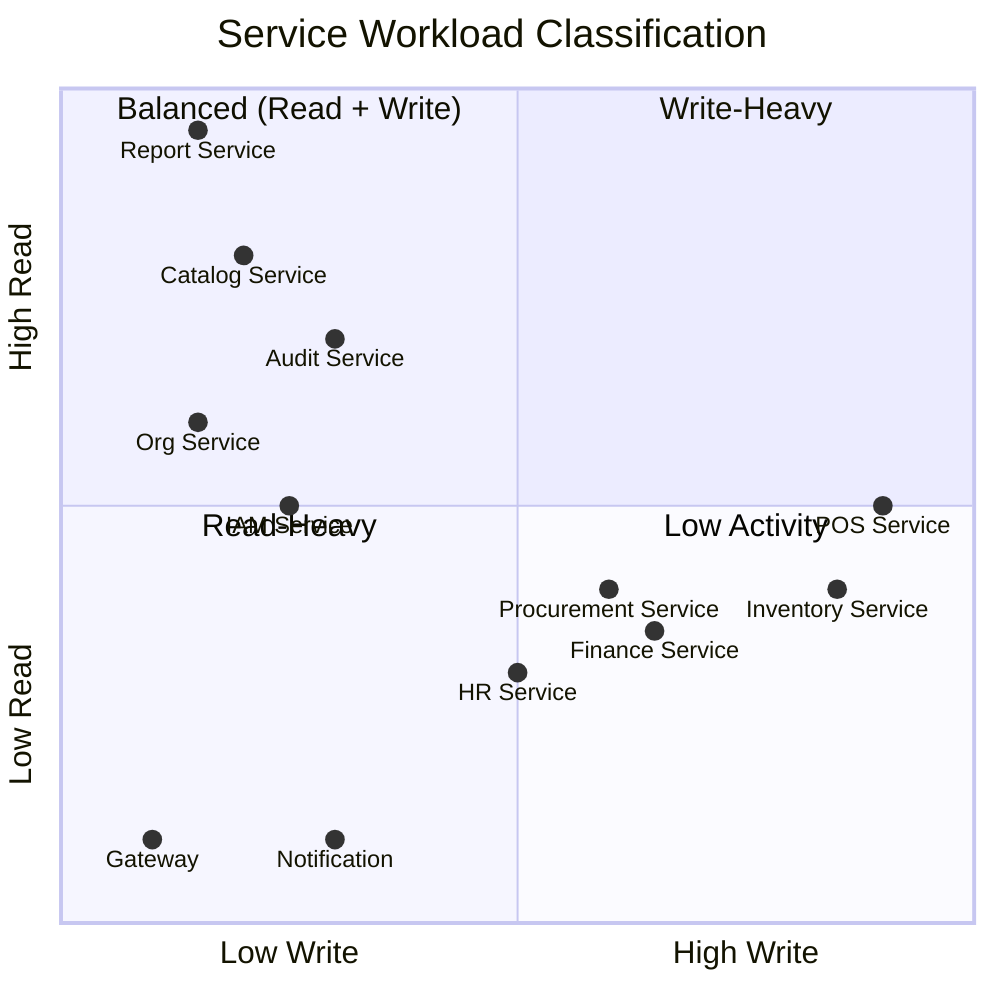
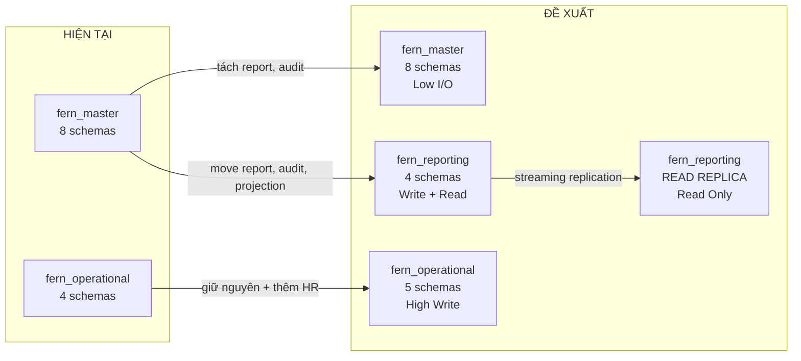

# FERN Database Architecture — Đề xuất tách Database clusters

## 1. Phân tích hiện trạng

### 1.1 Bất nhất quán giữa docker-compose và application.yml

Hiện tại có **2 nguồn sự thật không khớp nhau**:

| Service | `application.yml` (default) | `docker-compose.yml` | Nhận xét |
|---|---|---|---|
| **iam** | `fern_master/iam` | `fern_master/iam` | ✅ Khớp |
| **org** | `fern_master/org` | `fern_master/org` | ✅ Khớp |
| **catalog** | `fern_master/catalog` | `fern_master/catalog` | ✅ Khớp |
| **audit** | `fern_master/audit` | `fern_master/audit` | ✅ Khớp |
| **gateway** | `fern_master/gateway` | `fern_master/gateway` | ✅ Khớp |
| **notification** | `fern_master/notification` | — | ✅ (only in yml) |
| **report** | `fern_master/report` | `fern_master/report` | ✅ Khớp |
| **pos** | ⚠️ `fern_operational/pos` | ❌ `fern_master/pos` | 🔴 **BẤT NHẤT** |
| **inventory** | ⚠️ `fern_operational/inventory` | ❌ `fern_master/inventory` | 🔴 **BẤT NHẤT** |
| **procurement** | `fern_operational/procurement` | `fern_operational/procurement` | ✅ Khớp |
| **hr** | `fern_operational/hr` | ❌ `fern_master/hr` | 🔴 **BẤT NHẤT** |
| **finance** | `fern_operational/finance` | `fern_operational/finance` | ✅ Khớp |

> [!CAUTION]
> **3 services (POS, Inventory, HR)** có application.yml trỏ đến `fern_operational` nhưng docker-compose override ngược lại thành `fern_master`. Điều này nghĩa là local dev chạy đúng nhưng **production deployment** (nếu dùng default config) sẽ trỏ sai database.

### 1.2 Multi-datasource Services (hiện tại)

Một số services đã connect tới **nhiều database**:

| Service | Primary | Master/Config | Projection | 
|---|---|---|---|
| **finance** | `fern_operational/finance` | `fern_master/config` | `fern_master/finance_projection` |
| **procurement** | `fern_operational/procurement` | `fern_master/procurement_master` | — |
| **hr** | `fern_operational/hr` | `fern_master/hr_master` | — |

→ **Nhận xét**: Hệ thống đã áp dụng pattern multi-datasource đúng cách cho 3/12 services. Pattern này cần mở rộng.

---

## 2. Phân loại Workload cho từng Service



| Category | Services | Đặc tính |
|---|---|---|
| **🔴 Write-Heavy (Transactional)** | POS, Inventory | Cần low-latency writes, locking, advisory locks. POS peak giờ cao điểm |
| **🟠 Balanced (Write + Read)** | Procurement, Finance, HR | Write PO/GR/Payroll + read list/details. Moderate throughput |
| **🟢 Read-Heavy (Query)** | Report, Audit, Catalog, Org | Chủ yếu đọc, queries aggregated, export. Có thể dùng replica |
| **⚪ Low Activity (Metadata)** | IAM, Gateway, Notification | Config, auth, routes. Rất ít I/O |

---

## 3. Đề xuất kiến trúc — 3 Database + 1 Read Replica

```mermaid
graph TB
    subgraph "PostgreSQL Cluster Primary"
        subgraph "fern_master (Metadata & Config)"
            IAM_S[iam schema]
            ORG_S[org schema]
            CATALOG_S[catalog schema]
            GW_S[gateway schema]
            NOTIF_S[notification schema]
            CONFIG_S[config schema]
            PROC_MASTER_S[procurement_master schema]
            HR_MASTER_S[hr_master schema]
        end
        
        subgraph "fern_operational (Transactional)"
            POS_S[pos schema]
            INV_S[inventory schema]
            PROC_S[procurement schema]
            FIN_S[finance schema]
            HR_S[hr schema]
        end
        
        subgraph "fern_reporting (Projections & Reports)"
            RPT_RAW[raw_events schema]
            RPT_S[report schema]
            AUDIT_S[audit schema]
            FIN_PROJ_S[finance_projection schema]
        end
    end
    
    subgraph "PostgreSQL Read Replica"
        RPT_R[(fern_reporting<br/>READ REPLICA)]
    end
    
    POS[POS Service] -->|write| POS_S
    INV[Inventory Service] -->|write| INV_S
    PROC[Procurement Service] -->|write| PROC_S
    PROC -->|read config| PROC_MASTER_S
    FIN[Finance Service] -->|write| FIN_S
    FIN -->|read config| CONFIG_S
    FIN -->|write projections| FIN_PROJ_S
    HR[HR Service] -->|write| HR_S
    HR -->|read config| HR_MASTER_S
    
    IAM_SVC[IAM Service] --> IAM_S
    ORG_SVC[Org Service] --> ORG_S
    CAT_SVC[Catalog Service] --> CATALOG_S
    
    RPT_SVC[Report Service] -->|write events| RPT_RAW
    RPT_SVC -->|read reports| RPT_R
    AUDIT_SVC[Audit Service] -->|write| AUDIT_S
    AUDIT_SVC -->|read| RPT_R
    
    POS_S -.->|replication| RPT_R
    FIN_PROJ_S -.->|replication| RPT_R
    
    style RPT_R fill:#4CAF50,color:#fff
    style POS_S fill:#f44336,color:#fff
    style INV_S fill:#f44336,color:#fff
    style RPT_RAW fill:#2196F3,color:#fff
    style AUDIT_S fill:#2196F3,color:#fff
```



### 3.1 Database: `fern_master` — Metadata & Configuration

| Schema | Service | Vai trò |
|---|---|---|
| `iam` | IAM Service | User, roles, permissions |
| `org` | Org Service | Regions, outlets, hierarchy |
| `catalog` | Catalog Service | Menu, recipes, pricing |
| `gateway` | API Gateway | Route audit, outbox |
| `notification` | Notification Service | Templates, delivery logs |
| `config` | Finance Service (read-only) | Fiscal policies, tax config |
| `procurement_master` | Procurement Service (read-only) | Supplier master data |
| `hr_master` | HR Service (read-only) | Contract templates |

**Đặc tính**: Ít thay đổi, low throughput, dùng chung cho lookup.

### 3.2 Database: `fern_operational` — High-Throughput Transactional

| Schema | Service | Vai trò | QPS ước lượng |
|---|---|---|---|
| `pos` | POS Service | Sale orders, payments, sessions | **500-2000 writes/min** peak |
| `inventory` | Inventory Service | Stock balances, reservations, txns | **200-800 writes/min** peak |
| `procurement` | Procurement Service | POs, GRs, invoices | 50-100 writes/min |
| `finance` | Finance Service | Payroll runs, expense records | 20-50 writes/min |
| `hr` | HR Service | Employees, attendance, shifts | 30-60 writes/min |

**Đặc tính**: Heavy writes, row locks, advisory locks, outbox polling. **Cần tuning**: `shared_buffers`, `wal_level`, `max_connections`.

### 3.3 Database: `fern_reporting` — Read-Heavy Projections (🆕 MỚI)

| Schema | Service | Vai trò |
|---|---|---|
| `raw_events` | Report Service | Kafka event ingestion (write) |
| `report` | Report Service | Aggregated projections (read) |
| `audit` | Audit Service | Audit logs (write, occasional read) |
| `finance_projection` | Finance Service | Accounting postings, reconciliation |

**Đặc tính**: 
- **Write path**: Kafka consumers ingest events vào `raw_events` và `audit`
- **Read path**: Dashboard queries, report exports, audit search
- **Read Replica**: Chạy tất cả READ queries trên read replica → **zero impact lên operational DB**

### 3.4 Read Replica cho `fern_reporting`

```
fern_reporting (Primary) ← Kafka consumers WRITE events
          │
          │ PostgreSQL Streaming Replication
          ▼
fern_reporting (Replica) ← Report queries, audit search, export
```

- Report Service dùng **2 datasources**:
  - `write-datasource` → Primary (ingest Kafka events)
  - `read-datasource` → Replica (serve API queries)
- Audit Service tương tự: write vào primary, search/export từ replica
- Finance projection reads cũng chuyển sang replica

---

## 4. So sánh hiện tại vs đề xuất



| Metric | Hiện tại | Đề xuất | Cải thiện |
|---|---|---|---|
| Write contention | POS vs Report trên cùng DB | Tách riêng DB | ✅ Loại bỏ hoàn toàn |
| Report query impact | Ảnh hưởng POS performance | Read replica | ✅ Zero impact |
| Max connections pool | 1 pool shared 12 services | 3 pools riêng | ✅ Tuning per workload |
| Backup strategy | 1 backup = everything | Backup per criticality | ✅ Faster recovery |
| Horizontal scaling | Không thể | Replica cho reporting | ✅ Scale reads |

---

## 5. Implementation Plan — Code Changes

### Phase 1: Fix docker-compose inconsistencies

#### [MODIFY] [docker-compose.yml](file:///Users/nguyenhien/Documents/FERN/docker-compose.yml)
Fix 3 services đang trỏ sai database:

```diff
  pos-service:
    environment:
-     FERN_POS_JDBC_URL: jdbc:postgresql://postgres:5432/fern_master?currentSchema=pos
+     FERN_POS_JDBC_URL: jdbc:postgresql://postgres:5432/fern_operational?currentSchema=pos

  inventory-service:
    environment:
-     FERN_INVENTORY_JDBC_URL: jdbc:postgresql://postgres:5432/fern_master?currentSchema=inventory
+     FERN_INVENTORY_JDBC_URL: jdbc:postgresql://postgres:5432/fern_operational?currentSchema=inventory

  hr-service:
    environment:
+     FERN_HR_JDBC_URL: jdbc:postgresql://postgres:5432/fern_operational?currentSchema=hr
```

### Phase 2: Tạo `fern_reporting` database

#### [MODIFY] [01-init-databases.sql](file:///Users/nguyenhien/Documents/FERN/backend/infrastructure/postgres/init/01-init-databases.sql)

```sql
CREATE DATABASE fern_operational;
CREATE DATABASE fern_reporting;
```

### Phase 3: Migrate Report Service → `fern_reporting`

#### [MODIFY] [application.yml (report)](file:///Users/nguyenhien/Documents/FERN/backend/services/report-service/src/main/resources/application.yml)

```yaml
spring:
  datasource:
    url: ${FERN_REPORT_JDBC_URL:jdbc:postgresql://127.0.0.1:55432/fern_reporting?currentSchema=raw_events}
    
fern:
  read-datasource:
    url: ${FERN_REPORT_READ_JDBC_URL:${FERN_REPORT_JDBC_URL:jdbc:postgresql://127.0.0.1:55432/fern_reporting?currentSchema=report}}
    username: ${FERN_DB_USERNAME:}
    password: ${FERN_DB_PASSWORD:}
```

> Dev environment: read-datasource = primary (cùng 1 instance)  
> Production: read-datasource = replica endpoint

#### [NEW] ReportDatasourceConfig.java
- `@Primary` datasource cho write (Kafka ingestion)
- `@Qualifier("reportReadJdbcTemplate")` cho API queries, routed to read replica

### Phase 4: Migrate Audit Service → `fern_reporting`

#### [MODIFY] [application.yml (audit)](file:///Users/nguyenhien/Documents/FERN/backend/services/audit-service/src/main/resources/application.yml)

```yaml
spring:
  datasource:
    url: ${FERN_AUDIT_JDBC_URL:jdbc:postgresql://127.0.0.1:55432/fern_reporting?currentSchema=audit}

fern:
  read-datasource:
    url: ${FERN_AUDIT_READ_JDBC_URL:${FERN_AUDIT_JDBC_URL:jdbc:postgresql://127.0.0.1:55432/fern_reporting?currentSchema=audit}}
```

### Phase 5: Migrate Finance projection → `fern_reporting`

#### [MODIFY] [application.yml (finance)](file:///Users/nguyenhien/Documents/FERN/backend/services/finance-service/src/main/resources/application.yml)

```yaml
fern:
  projection-datasource:
    url: ${FERN_FINANCE_PROJECTION_JDBC_URL:jdbc:postgresql://127.0.0.1:55432/fern_reporting?currentSchema=finance_projection}
```

### Phase 6: Update docker-compose với topology mới

#### [MODIFY] [docker-compose.yml](file:///Users/nguyenhien/Documents/FERN/docker-compose.yml)

```diff
  audit-service:
    environment:
-     FERN_AUDIT_JDBC_URL: jdbc:postgresql://postgres:5432/fern_master?currentSchema=audit
+     FERN_AUDIT_JDBC_URL: jdbc:postgresql://postgres:5432/fern_reporting?currentSchema=audit

  report-service:
    environment:
-     FERN_REPORT_JDBC_URL: jdbc:postgresql://postgres:5432/fern_master?currentSchema=report
+     FERN_REPORT_JDBC_URL: jdbc:postgresql://postgres:5432/fern_reporting?currentSchema=raw_events

+ # Production: add postgres-replica service
+ # postgres-replica:
+ #   image: postgres:17-alpine
+ #   environment:
+ #       ...streaming replication from postgres...
+ #   ports:
+ #     - "55433:5432"
```

---

## 6. Database Connection Pool Tuning (per database)

| Database | Max Pool | Services | PG tuning |
|---|---|---|---|
| `fern_master` | 8 services × 10 = **80** | IAM, Org, Catalog, Gateway, Notification, + 3 read-only | `shared_buffers=256MB` |
| `fern_operational` | 5 services × 15 = **75** | POS, Inventory, Procurement, Finance, HR | `shared_buffers=1GB`, `wal_buffers=64MB`, `checkpoint_timeout=10min` |
| `fern_reporting` | 2 services × 10 = **20** | Report, Audit (write-side) | `shared_buffers=512MB`, `effective_cache_size=2GB` |
| `fern_reporting` (replica) | 2 services × 20 = **40** | Report, Audit (read-side), Finance projection reads | `hot_standby=on`, `max_standby_streaming_delay=30s` |

---

## 7. Flyway Migration Strategy

> [!WARNING]
> **Không cần migrate dữ liệu hiện tại** nếu đây là pre-production. Nếu đã có data production, cần thêm bước `pg_dump` → `pg_restore`.

| Service | Current Flyway path | New path | Change? |
|---|---|---|---|
| Report | `classpath:db/migration/postgresql/master` | `classpath:db/migration/postgresql/reporting` | ⚠️ Rename |
| Audit | `classpath:db/migration/postgresql/master` | `classpath:db/migration/postgresql/reporting` | ⚠️ Rename |
| POS | `classpath:db/migration/postgresql/operational` | ← Same | ✅ No change |
| Inventory | `classpath:db/migration/postgresql/operational` | ← Same | ✅ No change |

---

## 8. Production Read Replica Setup (tham khảo)

```yaml
# docker-compose.production.yml (bổ sung)
postgres-replica:
  image: postgres:17-alpine
  environment:
    POSTGRES_USER: fern_replica
    POSTGRES_PASSWORD: ${FERN_DB_REPLICA_PASSWORD}
  volumes:
    - ./infrastructure/postgres/replica/recovery.conf:/var/lib/postgresql/data/recovery.conf
  command: >
    postgres
    -c hot_standby=on
    -c max_standby_streaming_delay=30s
    -c wal_receiver_status_interval=10s
```

Trong AWS/GCP, dùng managed read replica:
- **AWS RDS**: `aws rds create-db-instance-read-replica`
- **GCP Cloud SQL**: `gcloud sql instances create --master-instance-name=...`

---

## 9. Open Questions

> [!IMPORTANT]
> **Q1**: Hệ thống đã có data production chưa? Nếu có, cần migration plan `pg_dump/pg_restore` cho report và audit schemas.

> [!IMPORTANT] 
> **Q2**: Bạn muốn implement **đầy đủ read replica datasource** trong Java code (multi-datasource config) hay chỉ cần thay đổi **docker-compose + application.yml** thời điểm này? (Multi-datasource Java config sẽ phức tạp hơn nhưng production-ready).

> [!WARNING]
> **Q3**: Flyway migrations hiện tại của report-service nằm ở `db/migration/postgresql/master`. Khi chuyển sang `fern_reporting` DB, có cần giữ compatibility với `fern_master` không (cho rollback)?
