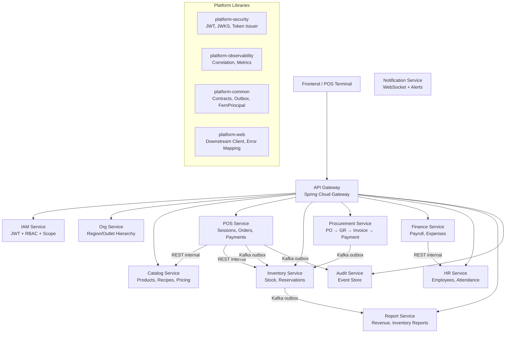
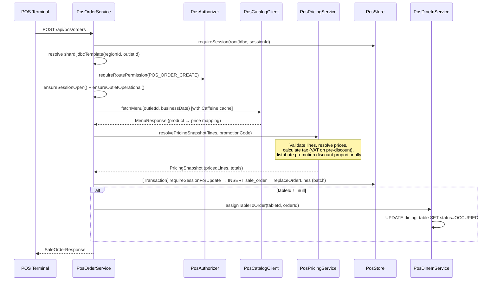
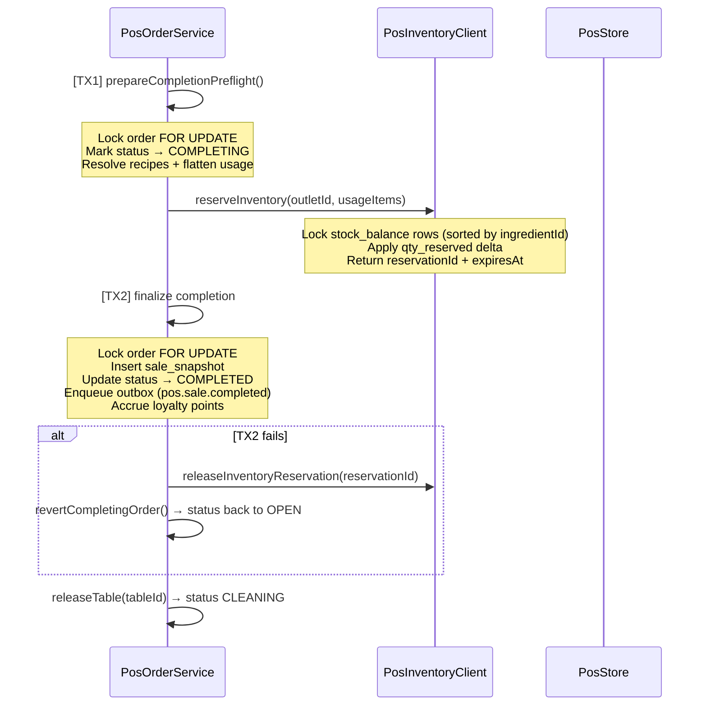
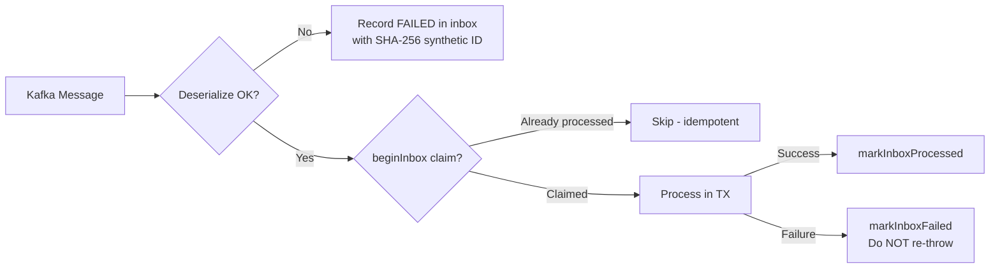
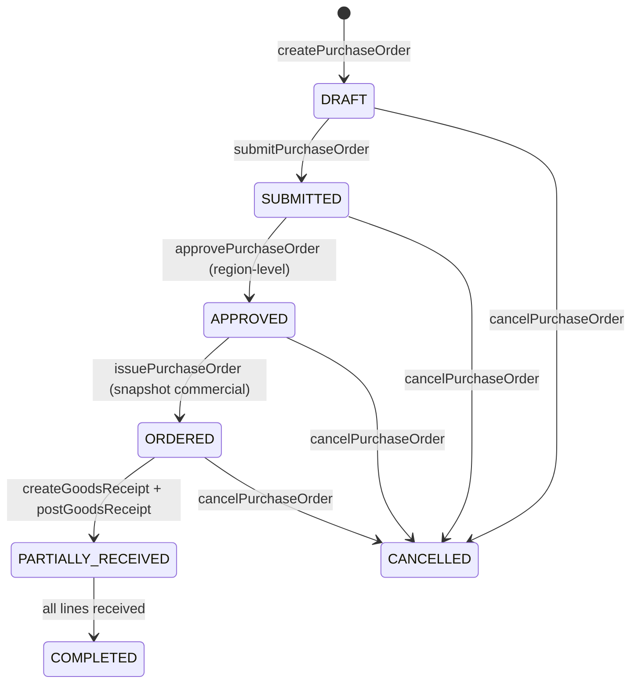
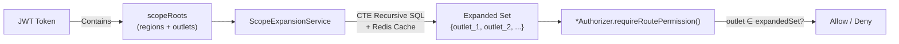

# 🔍 FERN Backend — Kiểm Định Kiến Trúc & Phân Tích Lỗi Tiềm Ẩn

> Phân tích chuyên sâu kiến trúc backend ERP cho chuỗi F&B, dựa trên ~536 file Java, 12 microservices, và 5 platform libraries.

---

## 1. Tổng Quan Kiến Trúc



### Nhận xét tổng thể

| Aspect | Đánh giá | Ghi chú |
|--------|----------|---------|
| **Architecture Style** | ⭐⭐⭐⭐ | Microservices đúng chuẩn, separation of concerns tốt |
| **Data Isolation** | ⭐⭐⭐⭐⭐ | Scope-based authorization + shard-aware routing |
| **Event Consistency** | ⭐⭐⭐⭐ | Transactional Outbox + Inbox pattern + DLQ |
| **Security** | ⭐⭐⭐⭐ | JWT + service-to-service tokens + scope expansion |
| **Observability** | ⭐⭐⭐⭐ | Correlation ID, structured logging, Micrometer metrics |
| **Testability** | ⭐⭐⭐ | Test support module exists, nhưng coverage chưa đủ rộng |
| **Production Readiness** | ⭐⭐⭐ | Nhiều lỗi tiềm ẩn cần fix trước khi go-live |

---

## 2. Phân Tích Code Flow Từng Service

### 2.1 POS Service — Trung Tâm Vận Hành

> [!IMPORTANT]
> Đây là service phức tạp nhất (48 Java files, 909 dòng riêng `PosOrderService`), xử lý toàn bộ luồng bán hàng.

#### Flow: Tạo đơn hàng (CreateOrder)



#### Flow: Hoàn thành đơn (CompleteOrder) — Critical Path



> [!TIP]
> **2-Phase Completion Pattern**: Tách thành `OPEN → COMPLETING → COMPLETED` là pattern tốt cho F&B. Nếu crash giữa 2 transactions, `recoverStaleCompletions()` job tự động rollback sau 2 phút.

---

### 2.2 Inventory Service — Quản Lý Tồn Kho

#### Stock Balance Model

```
stock_balance:
  qty_on_hand    = Tồn kho thực tế
  qty_reserved   = Đã giữ cho đơn đang completing
  qty_available  = on_hand - reserved (khả dụng để bán)
```

#### Reservation Flow (POS ↔ Inventory)

| Step | Action | qty_on_hand | qty_reserved | qty_available |
|------|--------|-------------|--------------|---------------|
| Initial | — | 100 | 0 | 100 |
| Reserve | `+reserved` | 100 | +10 | -10 |
| Commit (sale completed) | `-on_hand, -reserved` | -10 | -10 | unchanged |
| Release (TTL expired) | `-reserved` | unchanged | -10 | +10 |

#### Inbox Pattern (Event Consumption)



> [!NOTE]
> Pattern "swallow exception + record failure" ngăn Kafka retry vô hạn. Event FAILED có thể retry thủ công từ inbox table.

---

### 2.3 Catalog Service — Menu & Pricing Engine

#### Multi-Level Price Resolution

```
Priority: OUTLET (0) > REGION (1) > COUNTRY (2) > GLOBAL (3)
```

- `CatalogResolutionService` resolve price theo outlet → region → global
- Hỗ trợ `ProductOutletAvailabilityEntity` để bật/tắt sản phẩm theo outlet
- `PromotionRepository` + API resolution cho discount engine

---

### 2.4 Procurement Service — Chuỗi Cung Ứng

#### State Machine: Purchase Order



> [!TIP]
> Tiered approval (outlet tạo → region duyệt) phù hợp với mô hình chuỗi F&B. `commercialSnapshot` được lưu tại thời điểm issue để đảm bảo tính pháp lý.

---

### 2.5 IAM + Org + API Gateway — Security & Routing

#### Authorization Flow



- **Redis Cache Key**: `fern:org:scope-expansion:{version}:{regions}:{outlets}`
- **Version Bump**: Khi org tree thay đổi → auto invalidate cache

---

## 3. Cross-Cutting Patterns — Đánh Giá

### 3.1 Transactional Outbox ✅

| Service | Outbox Table | Publisher | Status |
|---------|-------------|-----------|--------|
| `pos-service` | `pos.outbox_event` | `PosOutboxPublisher` | ✅ Full |
| `inventory-service` | `inventory.outbox_event` | `InventoryOutboxPublisher` | ✅ Full |
| `procurement-service` | `procurement.outbox_event` | `ProcurementOutboxPublisher` | ✅ Full |
| `org-service` | `org.outbox_event` | `OrgOutboxService` | ✅ Full |
| `catalog-service` | `catalog.outbox_event` | `CatalogOutboxRepository` | ✅ Full |
| `hr-service` | via `HrOutboxPublisher` | ✅ | ✅ |
| `finance-service` | via `FinanceOutboxPublisher` | ✅ | ✅ |

### 3.2 Idempotency ✅

- **POS payments**: `idempotency_key` column + check before insert
- **Goods receipt posting**: `posted_idempotency_key` with duplicate detection
- **Inventory inbox**: `source_event_id` uniqueness via `ON CONFLICT`
- **Audit events**: Dual-key dedup (`source_event_id` + `idempotency_key`) with advisory locks

### 3.3 Shard-Aware Data Access ✅

```java
// POS Service shard resolution
private NamedParameterJdbcTemplate jdbcTemplate(Long regionId, Long outletId) {
    return operationalShardRegistry.get(
        shardResolver.resolve(RouteKey.of(regionId, outletId))
    ).jdbc();
}
```

> [!IMPORTANT]
> POS service đã chuyển sang **shard-aware architecture**: `PosStore` không inject `jdbcTemplate`, mà nhận nó từ caller. Đây là pattern đúng cho multi-outlet scalability.

---

## 4. 🚨 Lỗi Tiềm Ẩn & Rủi Ro Production

### P0 — Critical (Phải fix trước khi go-live)

---

#### BUG-P0-01: Race Condition trong `releaseTable()` sau `completeOrder()`

**File**: [PosOrderService.java](file:///Users/nguyenhien/Documents/FERN/backend/services/pos-service/src/main/java/com/fern/posservice/service/PosOrderService.java#L504)

```java
// Line 504: releaseTable NGOÀI transaction
dineInService.releaseTable(order.tableId(), order.regionId(), order.outletId());
return getOrder(principal, id);
```

**Vấn đề**: `releaseTable()` được gọi **bên ngoài** transaction TX2. Nếu app crash ngay sau `TX2.commit()` nhưng trước `releaseTable()`:
- Đơn hàng đã COMPLETED nhưng bàn vẫn OCCUPIED mãi mãi
- Không có recovery mechanism cho trạng thái bàn "ghost occupied"

**Fix**: Di chuyển `releaseTable()` vào trong TX2, hoặc thêm scheduled job cleanup bàn OCCUPIED không có đơn OPEN/COMPLETING.

---

#### BUG-P0-02: `cancelOrder()` không release bàn

**File**: [PosOrderService.java](file:///Users/nguyenhien/Documents/FERN/backend/services/pos-service/src/main/java/com/fern/posservice/service/PosOrderService.java#L549-L601)

```java
public SaleOrderResponse cancelOrder(FernPrincipal principal, Long id) {
    // ... updates status to CANCELLED ...
    // ❌ Missing: dineInService.releaseTable(order.tableId(), ...);
    return getOrder(principal, id);
}
```

**Vấn đề**: Khi hủy đơn dine-in, bàn vẫn ở trạng thái `OCCUPIED` → nhân viên không thể sử dụng lại bàn đó.

---

#### BUG-P0-03: `PosDineInService.requireTableById()` quét ALL shards

**File**: [PosDineInService.java](file:///Users/nguyenhien/Documents/FERN/backend/services/pos-service/src/main/java/com/fern/posservice/service/PosDineInService.java#L243-L258)

```java
private DiningTableRecord requireTableById(Long id) {
    for (var shardEntry : operationalShardRegistry.allShards()) {
        // Sequential scan across ALL shards
        DiningTableRecord record = shardEntry.jdbc().query(...)
    }
}
```

**Vấn đề**: O(N) scan qua tất cả database shards cho mỗi table lookup. Với 10 shards × 200ms latency = 2 giây response time. Đặc biệt tệ cho `updateTable()`, `getTableById()`, `updateTableStatus()` — tất cả gọi `requireTableById()`.

**Fix**: Truyền `outletId` vào tableId lookup, hoặc cache mapping `tableId → outletId` trong Redis.

---

#### BUG-P0-04: Inventory Service thiếu Shard-Aware Architecture

**File**: [InventoryService.java](file:///Users/nguyenhien/Documents/FERN/backend/services/inventory-service/src/main/java/com/fern/inventoryservice/service/InventoryService.java#L24), [InventoryRepository.java](file:///Users/nguyenhien/Documents/FERN/backend/services/inventory-service/src/main/java/com/fern/inventoryservice/service/InventoryRepository.java#L23)

```java
// InventoryService injects a SINGLE jdbcTemplate
private final NamedParameterJdbcTemplate jdbcTemplate;

// InventoryRepository also injects a SINGLE jdbcTemplate  
private final NamedParameterJdbcTemplate jdbcTemplate;
```

**Vấn đề**: POS Service đã migrate sang shard-aware routing, nhưng Inventory Service vẫn dùng single `jdbcTemplate`. Nếu dữ liệu inventory được phân shard theo region, service này sẽ chỉ query shard mặc định → **data loss / silent failures**.

**Fix**: Nếu inventory data hiện tại là single-shard, document rõ ràng. Nếu multi-shard, phải migrate tương tự POS.

---

### P1 — High (Fix trong sprint đầu tiên)

---

#### BUG-P1-01: `updateTableStatus()` thiếu validation state machine

**File**: [PosDineInService.java](file:///Users/nguyenhien/Documents/FERN/backend/services/pos-service/src/main/java/com/fern/posservice/service/PosDineInService.java#L173-L205)

```java
public DiningTableResponse updateTableStatus(FernPrincipal principal, Long id, String newStatus) {
    DiningTableStatus targetStatus = DiningTableStatus.valueOf(newStatus.toUpperCase());
    // ❌ No validation of valid transitions!
    // e.g., OCCUPIED → AVAILABLE bypasses CLEANING step
    // e.g., WHATEVER → OCCUPIED without linking to an order
}
```

**Vấn đề**: Cho phép chuyển trạng thái bàn tùy ý:
- `OCCUPIED → AVAILABLE` bỏ qua bước dọn bàn
- `AVAILABLE → OCCUPIED` mà không có đơn hàng → inconsistent state
- `CLEANING → OCCUPIED` vô nghĩa

**Fix**: Thêm transition map cho phép:
```
CLEANING → AVAILABLE
AVAILABLE → RESERVED  
RESERVED → AVAILABLE
```

---

#### BUG-P1-02: `PosCatalogClient.resolvePromotion()` nuốt mọi exception

**File**: [PosCatalogClient.java](file:///Users/nguyenhien/Documents/FERN/backend/services/pos-service/src/main/java/com/fern/posservice/service/PosCatalogClient.java#L151-L154)

```java
} catch (RuntimeException exception) {
    // Promotion not found is not a fatal error — treat as no discount
    return null;
}
```

**Vấn đề**: Catch-all `RuntimeException` nuốt cả lỗi network, timeout, circuit breaker open, 500 internal server error. Khách hàng nhập mã giảm giá hợp lệ nhưng Catalog Service tạm thời lỗi → đơn hàng tính sai giá.

**Fix**: Chỉ catch `ResourceNotFoundException` (404), re-throw các exception khác.

---

#### BUG-P1-03: `StockReservationService.releaseExpiredReservations()` thiếu distributed lock

**File**: [StockReservationService.java](file:///Users/nguyenhien/Documents/FERN/backend/services/inventory-service/src/main/java/com/fern/inventoryservice/service/StockReservationService.java#L508-L540)

```java
@Scheduled(fixedDelayString = "...")
public void releaseExpiredReservations() {
    // ❌ No RedisSchedulerLock like POS has for recoverStaleCompletions
    Instant now = Instant.now(clock);
    List<ReservationRecord> expiredReservations = jdbcTemplate.query(...);
}
```

**Vấn đề**: Trong multi-instance deployment, tất cả instances đồng thời chạy cleanup → double-release reservations → `qty_reserved` bị âm → stock data corruption.

> **So sánh**: `PosOrderService.recoverStaleCompletions()` đã có `RedisSchedulerLock`. Inventory lại thiếu.

---

#### BUG-P1-04: Menu Cache có thể gây sai giá trong cửa sổ TTL

**File**: [PosCatalogClient.java](file:///Users/nguyenhien/Documents/FERN/backend/services/pos-service/src/main/java/com/fern/posservice/service/PosCatalogClient.java#L58-L61)

```java
this.menuCache = Caffeine.newBuilder()
    .expireAfterWrite(Duration.ofSeconds(menuCacheTtlSeconds))  // default 60s
    .maximumSize(200)
    .build();
```

**Vấn đề**: Nếu quản lý thay đổi giá sản phẩm, POS terminal sẽ **dùng giá cũ tối đa 60 giây**. Trong F&B giờ cao điểm, hàng chục đơn hàng có thể tính sai giá.

**Fix**: 
- Catalog Service publish event `catalog.price.changed` → POS invalidate cache
- Hoặc giảm TTL xuống 10 giây, chấp nhận thêm load

---

#### BUG-P1-05: `PosStore.getSaleSnapshot()` trả về raw `Map` từ JDBC

**File**: [PosStore.java](file:///Users/nguyenhien/Documents/FERN/backend/services/pos-service/src/main/java/com/fern/posservice/service/PosStore.java#L225-L234)

```java
public Map<String, Object> getSaleSnapshot(NamedParameterJdbcTemplate jdbcTemplate, Long saleOrderId) {
    return jdbcTemplate.query(..., rs -> {
        if (!rs.next()) return null;
        return rs.getObject("order_snapshot", Map.class);  // ❌ Raw type
    });
}
```

**Vấn đề**: `rs.getObject("order_snapshot", Map.class)` phụ thuộc vào JDBC driver trả về đúng kiểu. PostgreSQL JDBC driver sẽ trả `PGobject`, không phải `Map`. Code này **sẽ throw ClassCastException** tại runtime.

**Fix**: Parse jsonb column as String rồi deserialize bằng ObjectMapper.

---

### P2 — Medium (Fix trong các sprint tiếp theo)

---

#### BUG-P2-01: `listOrdersBySession()` N+1 trên customer lookup

**File**: [PosOrderService.java](file:///Users/nguyenhien/Documents/FERN/backend/services/pos-service/src/main/java/com/fern/posservice/service/PosOrderService.java#L200-L211)

```java
return store.listOrdersBySession(jdbcTemplate, posSessionId, limit).stream()
    .map(order -> {
        CustomerSummaryResponse cs = store.resolveCustomerSummary(rootJdbcTemplate(), order.customerId()); // ❌ N+1
        return store.mapOrder(order, store.queryOrderLines(jdbcTemplate, order.id()),
                store.queryPayments(jdbcTemplate, order.id()), cs);
    })
    .toList();
```

**Vấn đề**: Với `limit=50` orders:
- 50 queries cho `resolveCustomerSummary`
- 50 queries cho `queryOrderLines`
- 50 queries cho `queryPayments`
- **Tổng: 151 SQL queries** cho 1 API call

**Fix**: Batch load tương tự procurement: `batchLoadOrderLines(ids)`, `batchLoadPayments(ids)`, `batchLoadCustomers(customerIds)`.

---

#### BUG-P2-02: POS `order_number` generation không đảm bảo uniqueness

**File**: [PosReferenceCodeGenerator.java](file:///Users/nguyenhien/Documents/FERN/backend/services/pos-service/src/main/java/com/fern/posservice/service/PosReferenceCodeGenerator.java)

**Vấn đề**: Cần verify generator dùng DB sequence hoặc Snowflake ID. Nếu dùng in-memory counter, crash/restart sẽ gây trùng order_number.

---

#### BUG-P2-03: `AuditJdbcRepository.insertAuditEvent()` — SQL Injection tiềm ẩn qua `String.formatted()`

**File**: [AuditJdbcRepository.java](file:///Users/nguyenhien/Documents/FERN/backend/services/audit-service/src/main/java/com/fern/auditservice/repository/AuditJdbcRepository.java#L76-L116)

```java
writeJdbcTemplate.update("""
    INSERT INTO %s (...)
    """.formatted(AUDIT_EVENT_TABLE), params);  // Table name via String.format
```

**Vấn đề**: Dùng `String.formatted()` cho table name. Hiện tại `AUDIT_EVENT_TABLE` là constant nên an toàn, nhưng nếu ai đó refactor thành dynamic → SQL injection. 

**Fix**: Tách thành separate constant query strings thay vì runtime formatting.

---

#### BUG-P2-04: `InventoryRepository.applyBalanceDelta()` — `qty_available` tính toán duplicate

**File**: [InventoryRepository.java](file:///Users/nguyenhien/Documents/FERN/backend/services/inventory-service/src/main/java/com/fern/inventoryservice/service/InventoryRepository.java#L91-L92)

```sql
SET qty_on_hand = qty_on_hand + :delta,
    qty_available = (qty_on_hand + :delta) - qty_reserved,
```

**Vấn đề**: PostgreSQL evaluates `qty_on_hand + :delta` trong SET clause trước khi gán, nhưng `(qty_on_hand + :delta)` trong expression lại dùng **giá trị cũ** của `qty_on_hand`. Điều này là **đúng** trong PostgreSQL vì SET clause dùng old values. Tuy nhiên, nếu có concurrent update (bao giờ cũng có lúc cao điểm), cần **FOR UPDATE lock** trước khi update, hiện `applyBalanceDelta()` **không lock** — `ensureBalanceRow()` không lock, chỉ upsert.

> **Lưu ý**: `lockStockBalance()` có `FOR UPDATE`, nhưng `applyBalanceDelta()` không gọi nó. Chỉ một số flow (reservation) lock trước khi update.

---

#### BUG-P2-05: `PosStore.mapOrder()` không resolve `tableName`

**File**: [PosStore.java](file:///Users/nguyenhien/Documents/FERN/backend/services/pos-service/src/main/java/com/fern/posservice/service/PosStore.java#L289-L316)

```java
public SaleOrderResponse mapOrder(...) {
    String tableName = null;
    // Table name is resolved by the caller via DineInService if needed
    return new SaleOrderResponse(
        ...
        order.tableId(),
        tableName,  // ❌ Always null
        ...
    );
}
```

**Vấn đề**: `tableName` luôn `null` trong API response. Frontend sẽ không hiển thị được tên bàn, phải resolve bằng tableId.

---

#### BUG-P2-06: `nextReferenceNumber()` trong Procurement sử dụng `ZonedDateTime.now(clock)`

**File**: [PurchaseFlowService.java](file:///Users/nguyenhien/Documents/FERN/backend/services/procurement-service/src/main/java/com/fern/procurementservice/service/PurchaseFlowService.java#L412-L422)

```java
String datePart = java.time.ZonedDateTime.now(clock).toLocalDate().format(
    java.time.format.DateTimeFormatter.ofPattern("yyyyMM")
);
```

**Vấn đề**: `ZonedDateTime.now(clock)` sử dụng system timezone. Nếu server ở UTC nhưng business hoạt động ở GMT+7, reference number sẽ dùng sai ngày vào khoảng 0:00-7:00 sáng → confusing cho accounting.

**Fix**: Sử dụng outlet timezone hoặc explicit timezone từ config.

---

#### BUG-P2-07: `PosSessionService.openSession()` — currency validation case-insensitive nhưng lưu original case

**File**: [PosSessionService.java](file:///Users/nguyenhien/Documents/FERN/backend/services/pos-service/src/main/java/com/fern/posservice/service/PosSessionService.java#L58)

```java
if (!region.currencyCode().equalsIgnoreCase(request.currencyCode())) {
    throw new ConflictException("Session currency does not match outlet region currency");
}
// But saves: region.currencyCode() — not normalized
```

**Vấn đề nhẹ**: Request gửi `vnd` thay vì `VND` → validation pass nhưng lưu `VND` từ region. Không phải bug, nhưng nên document rõ.

---

### P3 — Low (Technical Debt)

---

#### BUG-P3-01: Catalog Service chưa có InternalCatalogController cho `promotion-resolution`

Cần kiểm tra endpoint `/internal/catalog/promotion-resolution` thực sự tồn tại trong Catalog Service, vì `PosCatalogClient` gọi endpoint này.

#### BUG-P3-02: Finance Service và HR Service — Cần kiểm tra Kafka consumer có DLQ pattern

Finance và HR services có outbox publishers nhưng cần xác nhận rằng consumer-side cũng có `KafkaErrorHandlerConfig` tương tự inventory/report/notification.

#### BUG-P3-03: Missing `RecordMapper` abstraction

`SessionRecord`, `OrderRecord`, `PurchaseOrderRecord`, etc. đều có mapping code lặp lại (10+ dòng `rs.getLong()`, `rs.getString()`...) — scattered across `PosStore`, `PosSessionService`, `PosDineInService`. Nên tách ra `RecordMapper<T>`.

#### BUG-P3-04: `PosOrderService` có quá nhiều constructor dependencies (20 params)

Constructor injection với 20 tham số là code smell. Nên group thành domain-specific config objects hoặc tách service.

---

## 5. Tổng Kết — Đề Xuất Ưu Tiên

| Priority | Issue | Effort | Impact |
|----------|-------|--------|--------|
| 🔴 P0-01 | Race condition `releaseTable()` ngoài TX | 1h | Ghost occupied tables |
| 🔴 P0-02 | Cancel order không release bàn | 30m | Bàn locked vĩnh viễn |
| 🔴 P0-03 | Table lookup scan all shards | 2h | 2s+ API latency |
| 🔴 P0-04 | Inventory single-shard mismatch | 4h | Data loss potential |
| 🟠 P1-01 | Table status no state machine | 2h | Inconsistent table state |
| 🟠 P1-02 | Promotion swallows all exceptions | 30m | Silent price errors |
| 🟠 P1-03 | Reservation cleanup no dist lock | 1h | Stock corruption |
| 🟠 P1-04 | Menu cache stale pricing | 2h | Wrong prices |
| 🟠 P1-05 | Sale snapshot ClassCastException | 1h | Runtime crash |
| 🟡 P2-01 | Order listing N+1 | 2h | Slow listing API |
| 🟡 P2-04 | Balance delta concurrent safety | 2h | Race condition |
| 🟡 P2-05 | tableName always null | 30m | UI missing data |
| 🟡 P2-06 | Reference number timezone | 30m | Wrong date in PO number |

---

## 6. Điểm Mạnh Nổi Bật

> [!TIP]
> Các pattern sau đây rất phù hợp cho hệ thống chuỗi F&B enterprise và nên được giữ/mở rộng:

1. **Scope-Based Authorization**: Closure Table + Redis versioned cache — scale tốt cho 100+ outlets
2. **Transactional Outbox Pattern**: Consistent, tất cả 7 services đều implement
3. **Inbox Idempotency**: SHA-256 synthetic ID cho corrupt messages — creative approach
4. **2-Phase Order Completion**: `OPEN → COMPLETING → COMPLETED` với recovery job
5. **Multi-Level Pricing**: 4-tier priority resolution (Outlet > Region > Country > Global)
6. **Session-Based POS**: `business_date` + `terminal_id` + reconciliation flow
7. **Shard-Aware PosStore**: Clean separation — caller resolves shard, store just queries
8. **Advisory Locks**: `pg_advisory_xact_lock` cho session open scope — prevents duplicate sessions
9. **Operational Alert Publisher**: Proactive alerting cho payment failures
10. **Circuit Breaker on Downstream Calls**: Resilience4j cho catalog/inventory clients
