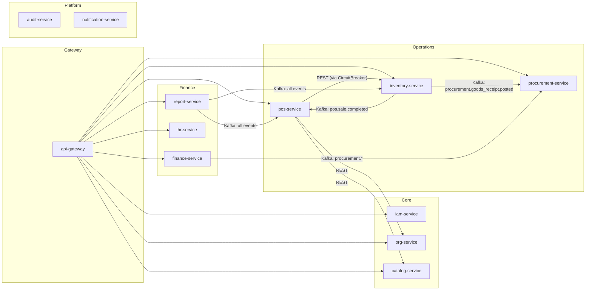
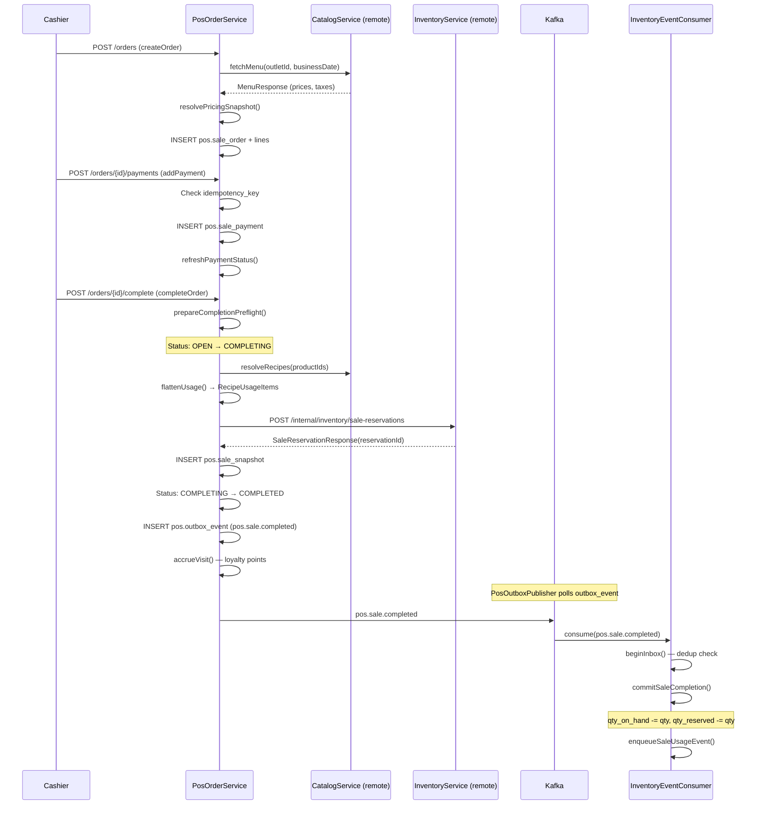
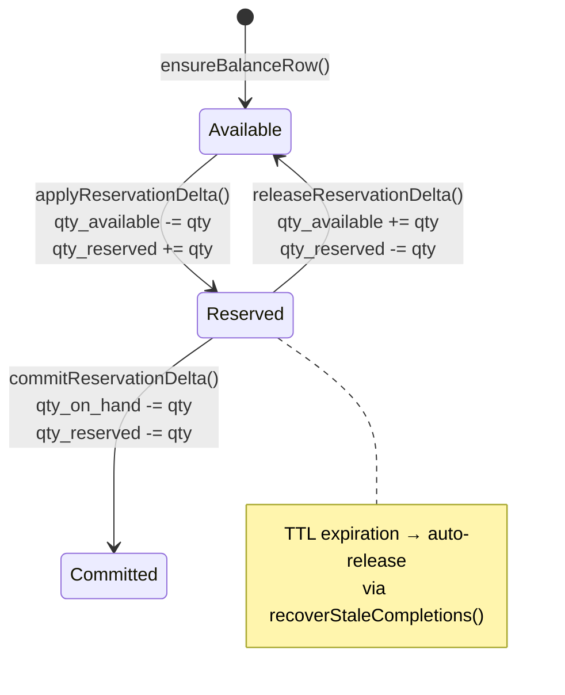
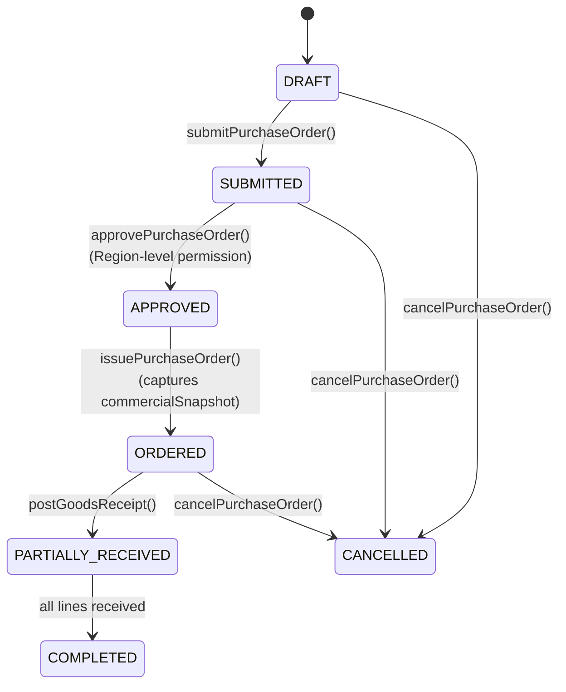

# FERN Backend — Kiến Trúc & Code Audit Chi Tiết

> **Phạm vi**: 12 microservices, ~5,500 LOC core logic  
> **Ngày audit**: 2026-04-04  
> **Ngữ cảnh**: Hệ thống ERP cho chuỗi F&B multi-outlet

---

## 1. Tổng Quan Kiến Trúc



### Đánh giá kiến trúc tổng thể: ⭐⭐⭐⭐ (4/5)

| Tiêu chí | Đánh giá |
|:---|:---|
| Phân chia microservice | ✅ Hợp lý, đúng bounded context cho F&B |
| Scope-based authorization | ✅ Excellent — Region/Outlet hierarchy + Closure Table |
| Event-driven consistency | ✅ Outbox/Inbox pattern, idempotency keys |
| Multi-outlet pricing | ✅ 4-level scope resolution (Global → Country → Region → Outlet) |
| Shard-aware data access | ✅ `OperationalShardRegistry` + `ShardResolver` |
| Observability | ✅ Correlation-ID propagation, Micrometer metrics |
| Concurrency control | ✅ Pessimistic locking (FOR UPDATE), advisory locks |

---

## 2. Phân Tích Flow Code Chi Tiết

### 2.1 POS Order Lifecycle — Flow Chính



**Nhận xét flow:**
- ✅ Transition qua trạng thái trung gian `COMPLETING` — rất tốt cho crash recovery
- ✅ `recoverStaleCompletions()` scheduled job dọn dẹp orders stuck ở COMPLETING
- ✅ Idempotent payments với unique `idempotency_key`
- ✅ Circuit breaker cho downstream calls tới inventory

---

### 2.2 Inventory Balance Lifecycle



**Nhận xét:**
- ✅ Balance invariant: `qty_available = qty_on_hand - qty_reserved`
- ✅ Sorted ingredient locking (`lockReservationBalances`) → tránh deadlocks
- ✅ Double-check pattern: `WHERE qty_available >= :qtyReservedDelta`

---

### 2.3 Procurement Flow



**Nhận xét:**
- ✅ Tiered approval (Outlet→Region) — phù hợp F&B chain
- ✅ `commercialSnapshot` captured at issue time — audit trail tốt
- ✅ GR posting triggers `procurement.goods_receipt.posted` event → inventory auto-update

---

## 3. Lỗi Tiềm Ẩn & Rủi Ro

### 🔴 P0 — Critical (Ảnh hưởng dữ liệu, có thể mất tiền)

#### BUG-001: Race condition trong `applyBalanceDelta()` — SQL dùng `qty_on_hand` cũ

[InventoryRepository.java:82-96](file:///Users/nguyenhien/Documents/FERN/backend/services/inventory-service/src/main/java/com/fern/inventoryservice/service/InventoryRepository.java#L82-L96)

```sql
SET qty_on_hand = qty_on_hand + :delta,
    qty_available = (qty_on_hand + :delta) - qty_reserved,
```

> [!CAUTION]
> `qty_available = (qty_on_hand + :delta)` sử dụng giá trị `qty_on_hand` **trước khi** SET, đây là hành vi đúng trong PostgreSQL. Tuy nhiên, khi `overwriteLastCountDateOnly = true` (stock count), SQL **không cập nhật `unit_cost`** nhưng vẫn có thể bị gọi với `unitCost` khác — nghĩa là `unit_cost` sẽ bị "trôi" nếu stock count xảy ra xen kẽ với goods receipt.

**Impact**: Unit cost trên stock_balance có thể bị stale sau stock count.
**Fix**: Khi `overwriteLastCountDateOnly = true`, vẫn nên `SET unit_cost = COALESCE(:unitCost, unit_cost)` nếu `unitCost != null`.

---

#### BUG-002: Expired reservation không tự động release `qty_reserved`

[StockReservationService.java:62-77](file:///Users/nguyenhien/Documents/FERN/backend/services/inventory-service/src/main/java/com/fern/inventoryservice/service/StockReservationService.java#L62-L77)

Khi reservation hết hạn (TTL), nếu cùng `sourceOrderId` gọi lại `reserveSale()`:

```java
if (StockReservationStatus.RESERVED.name().equals(existingReservation.status())) {
    releaseReservation(existingReservation);  // ← release old qty_reserved
}
clearReservationLines(existingReservation.id());
```

> [!CAUTION]
> Nếu **không** có retry (order bị abandon sau khi reservation tạo), `qty_reserved` sẽ **mãi mãi bị lock** cho đến khi `recoverStaleCompletions()` chạy. Nhưng `recoverStaleCompletions()` chỉ xử lý orders ở trạng thái `COMPLETING`, **không** xử lý reservations expired mà order vẫn ở `OPEN`.

**Impact**: Ghost locked inventory — available qty bị giảm vĩnh viễn.
**Fix**: Cần thêm scheduled job `releaseExpiredReservations()`:
```sql
UPDATE inventory.stock_balance 
SET qty_reserved = qty_reserved - rl.qty,
    qty_available = qty_available + rl.qty
FROM inventory.stock_reservation sr
JOIN inventory.stock_reservation_line rl ON rl.reservation_id = sr.id
WHERE sr.status = 'RESERVED' AND sr.expires_at < NOW()
  AND stock_balance.outlet_id = sr.outlet_id 
  AND stock_balance.ingredient_id = rl.ingredient_id
```

---

#### BUG-003: `listAvailability()` tải toàn bộ bảng `product_outlet_availability` vào memory

[CatalogPricingService.java:129-133](file:///Users/nguyenhien/Documents/FERN/backend/services/catalog-service/src/main/java/com/fern/catalogservice/service/CatalogPricingService.java#L129-L133)

```java
return productOutletAvailabilityRepository.findAll().stream()
        .filter(entity -> productId == null || ...)
        .filter(entity -> outletId == null || ...)
```

> [!WARNING]
> `findAll()` load **tất cả** records rồi filter in-memory. Với 500 products × 100 outlets = 50,000 rows.

**Fix**: Thêm custom query `findByProductIdAndOutletId(Long productId, Long outletId)` hoặc `@Query` trên repository.

---

### 🟠 P1 — High (Business logic bugs)

#### BUG-004: `completeOrder()` gọi `accrueVisit()` bên ngoài transaction

[PosOrderService.java:467-468](file:///Users/nguyenhien/Documents/FERN/backend/services/pos-service/src/main/java/com/fern/posservice/service/PosOrderService.java#L467-L468)

```java
// Accrue customer visit and loyalty points after successful completion
OrderRecord completedOrder = store.requireOrder(jdbcTemplate, id);
customerService.accrueVisit(...);
```

> [!WARNING]
> Nếu `accrueVisit()` throw exception, order đã COMPLETED nhưng loyalty points không được accrued. Không có retry mechanism.

**Fix**: Hoặc đưa vào transaction completion, hoặc publish vào outbox event để retry async.

---

#### BUG-005: `StockCountService.startStockCountSession()` insert lines N+1

[StockCountService.java:92-100](file:///Users/nguyenhien/Documents/FERN/backend/services/inventory-service/src/main/java/com/fern/inventoryservice/service/StockCountService.java#L92-L100) & [StockCountService.java:125-134](file:///Users/nguyenhien/Documents/FERN/backend/services/inventory-service/src/main/java/com/fern/inventoryservice/service/StockCountService.java#L125-L134)

```java
for (Long ingredientId : request.ingredientIds()) {
    jdbcTemplate.update("""INSERT INTO inventory.stock_count_line ...""");
}
```

> [!NOTE]
> Mỗi ingredient tạo 1 SQL INSERT. Chuỗi lớn với 200+ nguyên liệu sẽ tạo 400+ DB round-trips (insert + update systemQty).

**Fix**: Dùng `batchUpdate()` giống cách đã làm ở `PosStore.replaceOrderLines()`.

---

#### BUG-006: Discount amount luôn hardcoded = 0

[PosPricingService.java:75](file:///Users/nguyenhien/Documents/FERN/backend/services/pos-service/src/main/java/com/fern/posservice/service/PosPricingService.java#L75)

```java
pricedLines.add(new PricedLine(
    ...
    BigDecimal.ZERO,  // discountAmount — always zero
    ...
));
```

> [!IMPORTANT]
> Mặc dù catalog-service đã có `PromotionService.java`, nhưng POS pricing **hoàn toàn không gọi** promotion service. Discount luôn = 0.

**Impact**: Không áp dụng được khuyến mãi, combo, loyalty discount cho F&B chain.
**Fix**: Integrate `PromotionService` vào `PosPricingService.resolvePricingSnapshot()`.

---

#### BUG-007: `recoverStaleCompletions()` gọi `releaseInventoryReservationBySourceOrderId(null, ...)` — principal = null

[PosOrderService.java:711](file:///Users/nguyenhien/Documents/FERN/backend/services/pos-service/src/main/java/com/fern/posservice/service/PosOrderService.java#L711)

```java
inventoryClient.releaseInventoryReservationBySourceOrderId(null, staleOrder.orderId());
```

> [!WARNING]
> `principal = null` được truyền vào `FernDownstreamHeadersContributor.bearerToken()`. Nếu inventory-service validate Actor-User-Id header, request sẽ fail silently.

**Fix**: Sử dụng system service principal thay vì null.

---

#### BUG-008: `InventoryRepository.ensureBalanceRow()` có thể thiếu region_id

[InventoryRepository.java:230-238](file:///Users/nguyenhien/Documents/FERN/backend/services/inventory-service/src/main/java/com/fern/inventoryservice/service/InventoryRepository.java#L230-L238)

Khi Goods Receipt tạo balance row mới, `region_id` được lưu đúng. Nhưng khi reservation service gọi `lockExistingStockBalance()` mà balance chưa tồn tại, nó **không** gọi `ensureBalanceRow()` → `SELECT 1 FOR UPDATE` trả về empty → không lock → race condition.

[InventoryRepository.java:115-122](file:///Users/nguyenhien/Documents/FERN/backend/services/inventory-service/src/main/java/com/fern/inventoryservice/service/InventoryRepository.java#L115-L122)

```java
void lockExistingStockBalance(Long outletId, Long ingredientId) {
    jdbcTemplate.query("""SELECT 1 FROM inventory.stock_balance WHERE ... FOR UPDATE""", ...);
    // ← if no row exists, lock is a no-op!
}
```

> [!WARNING]
> Nếu ingredient chưa có stock_balance (ví dụ: nguyên liệu mới thêm vào recipe nhưng chưa nhập hàng), reservation sẽ fail tại `applyReservationDelta()` với error "Stock balance not found" thay vì tự tạo row.

**Fix**: Thay `lockExistingStockBalance` bằng `lockStockBalance` (có `ensureBalanceRow`), nhưng cần resolve `regionId`.

---

### 🟡 P2 — Medium (Performance & Maintainability)

#### BUG-009: Duplicate `RowMapper` code — `SessionRecord` mapping lặp lại 5+ lần

Các file [PosStore.java](file:///Users/nguyenhien/Documents/FERN/backend/services/pos-service/src/main/java/com/fern/posservice/service/PosStore.java), [PosSessionService.java](file:///Users/nguyenhien/Documents/FERN/backend/services/pos-service/src/main/java/com/fern/posservice/service/PosSessionService.java)

`SessionRecord` mapping từ `ResultSet` được copy-paste ở ít nhất 5 vị trí:
- `PosStore.requireSession()` (L37-61)
- `PosSessionService.findOpenSession()` (L313-331)
- `PosSessionService.requireSessionForUpdateOnShard()` (L359-377)
- `PosSessionService.listSessions()` (L149-167)

**Fix**: Extract thành `static RowMapper<SessionRecord>` ở `PosStore` hoặc `SessionRecord` class.

---

#### BUG-010: `instant()` helper method duplicated across 6+ service classes

Mỗi service có riêng method:
```java
private Instant instant(ResultSet rs, String col) throws SQLException {
    OffsetDateTime v = rs.getObject(col, OffsetDateTime.class);
    return v == null ? null : v.toInstant();
}
```

Lặp lại ở: `InventoryService`, `StockReservationService`, `StockCountService`, `WasteRecordService`, `StockAdjustmentService`, `PosStore`.

**Fix**: Move vào `platform-common` hoặc `PosSql`/`InventoryRepository` static helper.

---

#### BUG-011: `CatalogResolutionService.resolveMenu()` không phân trang

[CatalogResolutionService.java:71-94](file:///Users/nguyenhien/Documents/FERN/backend/services/catalog-service/src/main/java/com/fern/catalogservice/service/CatalogResolutionService.java#L71-L94)

```java
List<AvailableProductSummary> products = productOutletAvailabilityRepository
    .findAvailableProducts(outletId, ProductStatus.ACTIVE);
```

> [!NOTE]
> Load toàn bộ available products + resolve prices/taxes in-memory. Chuỗi lớn với 1000+ SKUs/outlet sẽ gây latency.

**Fix**: Phân trang hoặc cache menu theo outlet+businessDate.

---

#### BUG-012: Không có index hint cho `stock_reservation WHERE source_order_id`

[StockReservationService.java:312-327](file:///Users/nguyenhien/Documents/FERN/backend/services/inventory-service/src/main/java/com/fern/inventoryservice/service/StockReservationService.java#L312-L327)

```sql
SELECT ... FROM inventory.stock_reservation
WHERE source_order_id = :sourceOrderId FOR UPDATE
```

Cần đảm bảo index `UNIQUE(source_order_id)` tồn tại. Nếu thiếu → full table scan + row lock escalation.

---

#### BUG-013: `PurchaseFlowService.nextReferenceNumber()` dùng `LocalDate.now(clock)` nhưng format không timezone-aware

[PurchaseFlowService.java:413-422](file:///Users/nguyenhien/Documents/FERN/backend/services/procurement-service/src/main/java/com/fern/procurementservice/service/PurchaseFlowService.java#L413-L422)

```java
String datePart = java.time.LocalDate.now(clock).format(
    DateTimeFormatter.ofPattern("yyyyMM"));
```

> [!NOTE]
> `LocalDate.now(clock)` lấy date theo system timezone. Nếu outlet ở timezone khác (VD: HN vs HCM servers), PO number có thể lệch ngày.

**Fix**: Dùng `businessDate` từ request thay vì `LocalDate.now()`.

---

### 🔵 P3 — Low (Hardening, Best Practices)

#### BUG-014: Thiếu validation cho `qty` âm trong `CreateStockAdjustmentRequest`

Chỉ validate direction (IN/OUT) nhưng không validate `qty > 0`. User có thể gửi `qty = -5` + `direction = IN`, tạo hiệu ứng ngược.

---

#### BUG-015: `PosOrderService` constructor quá lớn (18 parameters)

[PosOrderService.java:71-108](file:///Users/nguyenhien/Documents/FERN/backend/services/pos-service/src/main/java/com/fern/posservice/service/PosOrderService.java#L71-L108)

18 constructor parameters là dấu hiệu của God Class. Nên tách thành:
- `PosOrderCompletionService` (completion + recovery logic)
- `PosOrderPaymentService` (payment handling)
- `PosOrderCrudService` (create/update/cancel)

---

#### BUG-016: Không có circuit breaker cho POS → Catalog calls

[PosCatalogClient.java](file:///Users/nguyenhien/Documents/FERN/backend/services/pos-service/src/main/java/com/fern/posservice/service/PosCatalogClient.java) — POS→Inventory có circuit breaker, nhưng POS→Catalog thì cần verify.

---

#### BUG-017: `OutletCloseCheckService` duplicated ở 3 services

- `inventory-service/OutletCloseCheckService.java` (1786 bytes)
- `procurement-service/OutletCloseCheckService.java` (1265 bytes)
- `finance-service/OutletCloseCheckService.java` (1457 bytes)

**Fix**: Move vào `platform-common` shared library.

---

#### BUG-018: Finance-to-Procurement consumer (`FinanceProcurementConsumer.java`) quá lớn

File `FinanceProcurementConsumer.java` có 32,548 bytes (~700+ lines). Nên tách thành:
- `FinanceGoodsReceiptHandler`
- `FinanceInvoiceHandler`
- `FinancePaymentHandler`

---

## 4. Đánh Giá Theo Module F&B

### 4.1 POS (Point of Sale)

| Feature | Status | Ghi chú |
|:---|:---:|:---|
| Session management | ✅ | OPEN→CLOSED→RECONCILED, multi-terminal support |
| Order CRUD | ✅ | With line replacement, pricing recalculation |
| Payment processing | ✅ | Idempotent, multi-method, overpay protection |
| Order completion | ✅ | 3-phase: preflight → reserve → commit |
| Cash reconciliation | ✅ | Discrepancy tracking |
| Customer/Loyalty | ⚠️ | Basic visit accrual, nhưng ngoài transaction |
| Discounts/Promotions | ❌ | Hardcoded zero — BUG-006 |
| Table management | ❌ | Không có cho Dine-in F&B |
| Kitchen Display (KDS) | ❌ | Không có integration |
| Split/Merge bills | ❌ | F&B cần tính năng này |

### 4.2 Inventory

| Feature | Status | Ghi chú |
|:---|:---:|:---|
| Stock balance tracking | ✅ | Per outlet, per ingredient |
| Sale reservation | ✅ | Lock-based, TTL expiration |
| Stock count | ✅ | Draft→Counting→Posted workflow |
| Waste recording | ✅ | With audit trail |
| Stock adjustment | ✅ | IN/OUT with idempotency |
| Goods receipt integration | ✅ | Via Kafka event |
| Expired reservation cleanup | ❌ | BUG-002 — ghost locked qty |
| Inter-outlet transfer | ❌ | Không hỗ trợ chuyển kho giữa outlets |
| Min/Max reorder levels | ❌ | Không có auto-reorder alert |
| FIFO/FEFO costing | ❌ | Chỉ có average unit cost |
| Batch/Lot tracking | ❌ | Không trace được lô hàng |

### 4.3 Procurement

| Feature | Status | Ghi chú |
|:---|:---:|:---|
| PO lifecycle | ✅ | Full 6-state machine |
| Tiered approval | ✅ | Outlet→Region permission |
| Goods receipt | ✅ | With idempotent posting |
| Supplier management | ✅ | Active/approved validation |
| Supplier invoice | ✅ | PayablesService |
| Partial receipt | ✅ | Progress tracking |
| 3-way matching | ⚠️ | Partial — PO vs GR, nhưng thiếu Invoice matching |
| Automated reorder | ❌ | Không có min-stock trigger |

### 4.4 Catalog

| Feature | Status | Ghi chú |
|:---|:---:|:---|
| Product CRUD | ✅ | Soft-delete support |
| Multi-level pricing | ✅ | Global→Country→Region→Outlet |
| Recipe/BOM | ✅ | Versioned, date-effective |
| Tax rates | ✅ | Time-bounded, overlap validation |
| Outlet availability | ✅ | Per-product toggle |
| Promotions | ⚠️ | `PromotionService.java` exists nhưng chưa integrate POS |
| UOM conversion | ✅ | Unit-of-measure conversion |
| Modifier/Add-on | ❌ | Quan trọng cho F&B (extra shot, less sugar...) |
| Combo/Bundle | ❌ | Không hỗ trợ combo pricing |

---

## 5. Điểm Mạnh Đáng Ghi Nhận

1. **Transactional Outbox Pattern** — triển khai đúng chuẩn enterprise: `AbstractJdbcOutboxPublisher` tái sử dụng ở tất cả services, có retry count, reclaim mechanism.

2. **Shard-aware architecture** — `OperationalShardRegistry` + `ShardResolver` cho phép horizontal scaling mà không cần redesign. POS service luôn resolve đúng shard cho mỗi outlet.

3. **Double-check locking pattern** — Tất cả state transitions đều check optimistic read → `FOR UPDATE` → re-validate → CAS update (`WHERE status = :currentStatus`).

4. **Inbox dedup with FAILED recovery** — `beginInboxRaw()` sử dụng `ON CONFLICT DO UPDATE WHERE status = 'FAILED'` cho phép retry failed events mà không mất idempotency.

5. **Correlation-ID propagation** — End-to-end tracing từ API Gateway → POS → Inventory → Kafka events.

6. **Commercial snapshot tại issue time** — PO capture snapshot tại thời điểm APPROVED→ORDERED, tạo audit trail không thể tamper.

---

## 6. Tổng Kết Ưu Tiên Xử Lý

| Priority | Count | Action Items |
|:---|:---:|:---|
| 🔴 P0 | 3 | BUG-001 (unit cost stale), BUG-002 (ghost reservation), BUG-003 (findAll OOM) |
| 🟠 P1 | 5 | BUG-004→008: Loyalty outside tx, N+1 stock count, no discounts, null principal, missing balance row |
| 🟡 P2 | 5 | BUG-009→013: Code duplication, no pagination, missing indexes, timezone issue |
| 🔵 P3 | 5 | BUG-014→018: Input validation, God Class, missing circuit breaker, code duplication |
| ❌ Missing | 6 | Table mgmt, Inter-outlet transfer, Min/Max reorder, KDS, Split bill, Modifier/Add-on |

> [!IMPORTANT]
> **BUG-002 (Ghost reservation)** là vấn đề nghiêm trọng nhất cho F&B chain vận hành thực tế. Trong giờ cao điểm, nếu cashier tạo order → app crash trước khi complete → reservation không bao giờ được release → slowly draining available inventory cho toàn bộ outlet.
